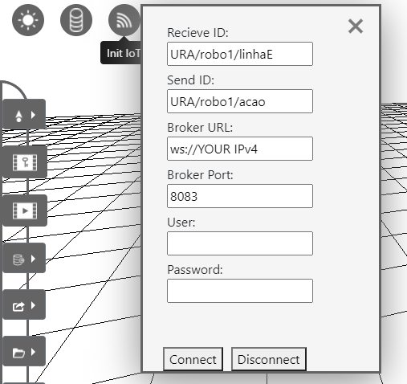
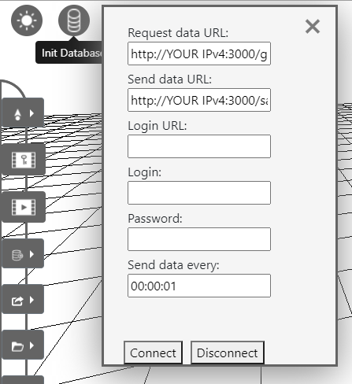
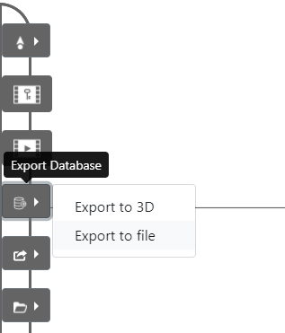
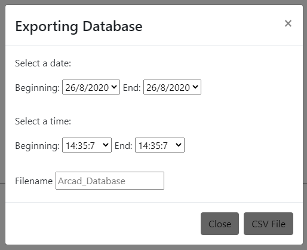

# Dev dependencies for the Arcad-URA demo

# Index

1. [Installation](#Installation)
2. [MQTT Broker](#Open-the-local-mqtt-broker)
3. [Generating Data](#Generating-Data)
4. [Database server](#Open-the-database-server)
5. [Arcad](#Open-Arcad)

If you will modify the demo, please read the [Data Structure Guidelines](./structures.md) first!

There is almost none error handling, so beware!

# Installation 

Clone this repo

Open a terminal

Run: `npm run install-dev`

## Open the local mqtt broker

### For Windows:

Go to the mqttBroker folder

Open a terminal

Run: `mosquitto -c ./demoConfig.txt`

### For Linux/Mac:

https://mosquitto.org/download/

But use the demoConfig.txt

## Generating Data 

To generate data you have two options:

    Run an Esp board with the code from the URA repo:
    https://github.com/Natalnet/lib_ura_esp/tree/master/devs/MQTT

    Run the simulation code from the Esp-Simulation folder

### Using an Esp board

#### Flash esp

https://docs.micropython.org/en/latest/esp8266/tutorial/intro.html

#### Put files in esp-MicroPython

Go to the URA folder

Open a new terminal

Run the command below:

    e.g ampy --port /serial/port put test.py

For linux 

    /serial/port = /dev/ttyUSB0 || /dev/tty.SLAB_USBtoUART

For windows

    /serial/port = COM#
		              # = port number

### Using the Esp-Simulation

Go to the Esp-Simulation folder

Open a new terminal 

Run: `node sim.js`

# Open the database server

Go to the dbServer folder

Open a new terminal

Run: `node server.js`

# Open Arcad

Link available only for NatalNet labs personnel.

<!-- ## https://carnaux.github.io/ArCad/app/editor/editor.html -->

## Connect Arcad with the broker server

User and Password are not required!!!

### Arcad will save MQTT data until the database function sends it to the database server, then it will erase it and store new data.

## Connect Arcad with the database server

Login does not works yet!!!

### REMEMBER TO CHANGE THE "YOUR IPv4" WITH YOUR IPv4

## Export using the button:

## And then select the time range: 

